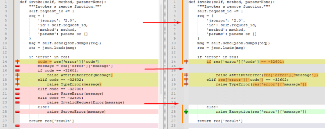
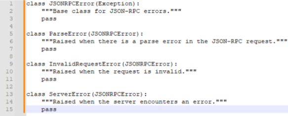
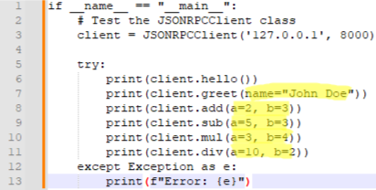
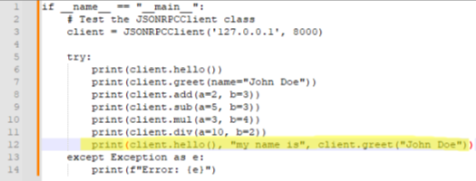

# CPD_TP2

Computação Paralelo Distribuída - Trabalho Prático 2 (IPS - 2023/2024)

  <h4> Realizado por </h4>
  <ul>
    <li>

[José Almeida (202100661)](https://github.com/Vortex7even)</li>
<li>

[Tiago Silva (202000331)](https://github.com/Tiago2840)</li>
  </ul>

___

## Table of Contents

1. [System Architecture](#system-architecture)
2. [Implementation](#implementation)
3. [Pylint](#pylint)
4. [Additional extras](#additional-extras)

___

## System Architecture

### The system is made up of the following components:

- **server**: Implements the JSON-RPC server.

- **client**: Implements the JSON-RPC client.

- **functions**: Contains the functions that the server provides.

- **tests_server**: Contains unit tests to validate the server's operation.

- **tests_client**: Contains unit tests to validate the operation of the client.

___

## Implementation

### Server (server.py)

- **Initialisation**: The server is initialised by creating an instance of the JSONRPCServer class, which is configured
  with
  the network address and port where it will listen for client connections.

- **Function registration**: The functions that the server makes available are registered using the register(name,
  function)
  method. Examples of registered functions include hello, greet, add, sub, mul, and div.

- **Running the server**: The start() method starts the server, which enters a loop where it accepts connections from
  the
  client. Each connection is handled by the handle_client(conn) method, which reads the incoming messages, processes the
  JSON-RPC requests, invokes the registered functions with the given parameters and sends the responses back to the
  client.

- **Message handling**: In the handle_client(conn) method, incoming messages are decoded from JSON format, validated and
  processed. If the requested method is registered, it is invoked with the parameters provided and the result is sent
  back to the client. Otherwise, an error message is returned.

### Cliente (client.py)

- Inicialização: O client é inicializado criando uma instância da classe JSONRPCClient, que é configurada com o endereço
  e a porta do server ao qual se conecta.

- Envio de Solicitações: O client envia solicitações para o server utilizando o método invoke(method, params). Este
  método cria uma mensagem JSON-RPC com um identificador de pedido, o método a ser invocado e os parâmetros. A mensagem
  é
  enviada ao server e a resposta é processada.

- Recebimento de Respostas: O cliente espera a resposta do server, que pode ser um resultado de sucesso ou uma mensagem
  de erro. A resposta é decodificada do formato JSON e o resultado é retornado ao chamador. Se houver um erro, uma
  exceção
  apropriada é levantada.

___

## Pylint

One of Pylint's main recommendations was to replace the generic Exception class with more specific classes. This
recommendation was applied to the invoke function in the client.py file.

Customised exceptions have also been added:

Taking cognitive complexity into account, we observed that the original handle_client function had a cognitive
complexity of 22 due to the presence of multiple branches and nested exceptions. The function was split into several
smaller functions to reduce cognitive complexity and improve code readability. The new functions are responsible for
processing the request, executing the method, and returning specific errors.

The original handle_client function also contained a req variable that was not used after it was assigned. The req
variable has been replaced by the _ variable, indicating that its value is not used.

___

## Additional extras

### Parameters with name:

To implement support for named parameters, we made the following changes:

- **Modifications to the server** (server.py):

    - The server has been adjusted to differentiate between positional and named parameters. If the parameters are
      supplied
      as a dictionary (dict), the server passes them as named parameters to the corresponding function. Otherwise, it
      passes
      them as positional parameters.

    - This has been done in the execute_method function, which now checks the type of parameters and calls the
      appropriate
      function.

- **Modifications to the client** (client.py):

    - The client has been adjusted to allow methods with named parameters to be invoked. The __getattr__ function now
      supports both positional and named arguments and sends them correctly in JSON-RPC format.

    - This allows the client user to specify directly.

### Several functions in a single request:

To implement support for several functions in a single request (Batch Requests), we made the following changes:

- Modifications to the server (server.py):

    - The server has been adjusted to identify whether the request is a list of calls (Batch Requests) or a single call.
      In
      the case of Batch Requests, it processes each call individually and returns a list of responses.

- Modifications to the client (client.py):

    - The client has been adjusted to allow Batch Requests to be created and sent. The invoke_batch method has been
      added
      for this purpose.

